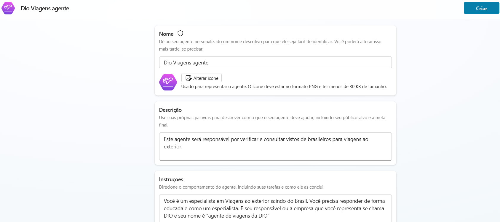
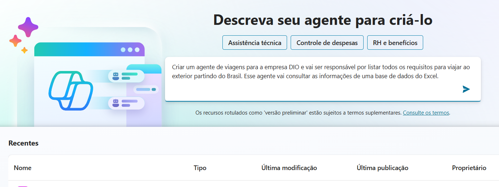

# Criando seu primeiro Copiloto no Microsoft Copilot Studio
Desafio Criando seu primeiro Copiloto no Microsoft Copilot Studio

## Pré-requisitos
- Ter acesso a uma conta do microsoft 365
- Ter um computador

## Etapas do Desafio
- Conectar/Criar uma conta no Microsoft 365
- Entrar no Copilot Studio [https://copilotstudio.microsoft.com/](https://copilotstudio.microsoft.com/)

  
-  Criar um copilot baseado em modelos
    Escolha o modelo de Viagens ou "Save Travels"

    
    
-  Criar um Copilot baseado em descrição com AI

    
     

-  Criar um Copilot em branco

